### Hi there 👋
- 🎓 I graduated with a **Master of Science in Computer Science** from **Northeastern University, Seattle** in May 2025 (GPA: 3.879/4.0).
- 🔭 I'm currently building **EchoChat** at IDitor — an AI-native social platform with vector-based memory retrieval, geospatial clustering, and multi-model AI integration.
- 🌱 I'm continuing to explore **retrieval-augmented generation, distributed systems, and scalable backend architectures**.
- 👯 I'm open to collaborating on **AI-driven web and mobile applications**, especially in social and productivity domains.
- 🤔 I'm exploring how to **optimize LLMs for resource-constrained devices**.
- 💬 Ask me about **full-stack development (Next.js, React, Flutter), cloud platforms (AWS, Supabase, Vercel), databases (PostgreSQL, Firebase), or AI/ML integrations (OpenAI, Gemini, Claude)**.
- 📫 How to reach me: [LinkedIn](https://www.linkedin.com/in/zhangshisimon/) | [Portfolio](https://zhangshi0512.github.io/) | [Email](mailto:zhangshi0512@gmail.com)
- 😄 Pronouns: He/Him
- ⚡ Fun fact: I started my career as an **architectural designer** before transitioning into software engineering.

---

### 🛠️ Technical Skills
- **Languages**: Python, TypeScript, Java, Kotlin, C++, JavaScript, SQL, HTML/CSS
- **Frameworks**: Node.js, Next.js, React, Flutter, Spring Boot
- **Tools**: Docker, Linux, GitHub Actions, CI/CD, Selenium, Supabase, Firebase, PostgreSQL, MySQL, MongoDB, Vercel KV, AWS

---

### 💼 Experience

**Founding Software Engineer – IDitor Inc.** *(Nov 2025 – Present)*
- Architected a **multi-platform social ecosystem** across Flutter mobile and Next.js web with a microservices backend; integrated Gemini, OpenAI, and Claude for automated Life Story generation and AI-moderated feeds.
- Engineered **vector-based embedding systems** for user matching and a custom random-walker clustering pipeline across 30k+ geospatial memories.
- Built **Python/Selenium scraping pipelines** and agent-driven research workflows; deployed serverless infrastructure on Vercel and Supabase with GitHub Actions CI/CD.
- Open-sourced the **OpenClaw Plugin** and **EchoMem Skill** for syncing local markdown memory into EchoMem Cloud.

**Software Engineer – IDitor Inc.** *(Sep 2024 – Dec 2024)*
- Built a **user-matching service** with Supabase + cosine similarity semantic search, improving recommendation accuracy by 20%.
- Developed a **real-time friend search engine** using Next.js & Vercel KV.
- Designed an **AI-driven chat simulation API** leveraging OpenAI, cutting response times by 30%.

**Software Engineer – Graph Academy** *(May 2024 – Aug 2024)*
- Built **AI-driven dating app features** in TypeScript/Next.js, boosting engagement by 30% via smoother page transitions.
- Implemented **personalized camera and profile-selection features**, raising interactions by 20%.
- Led **Firebase + Google Analytics tracking setup**, accelerating new-user registration by 50%.

**Research Assistant – Northeastern University** *(May 2023 – Dec 2023)*
- Adapted **YCSB+T** to benchmark NoSQL and distributed SQL databases for cloud workload comparisons.
- Conducted **NLP and transformer-based research** for semantic resume matching, improving recruiter efficiency by 25%.
- Built **embedding correlation visualizations** and contributed to open-source platform development.

**Architectural Designer – Ballinger** *(Feb 2020 – Nov 2022)*
- Worked on a **1.6M sq ft healthcare project**, managing SD/DD/CD documentation phases.
- Automated data workflows between Excel and Revit with **Python scripts**; collaborated with MEP teams for monthly value engineering.

---

### 📜 Certifications
- **AWS Academy Data Engineering** (Apr 2025)
- **Generative AI Fundamentals – Databricks** (Aug 2024)
- **Graduate Leadership Institute – Northeastern** (Aug 2024)

---

<table>
  <tr>
    <td>
      
    </td>
    <td>
      
    </td>
  </tr>
</table>